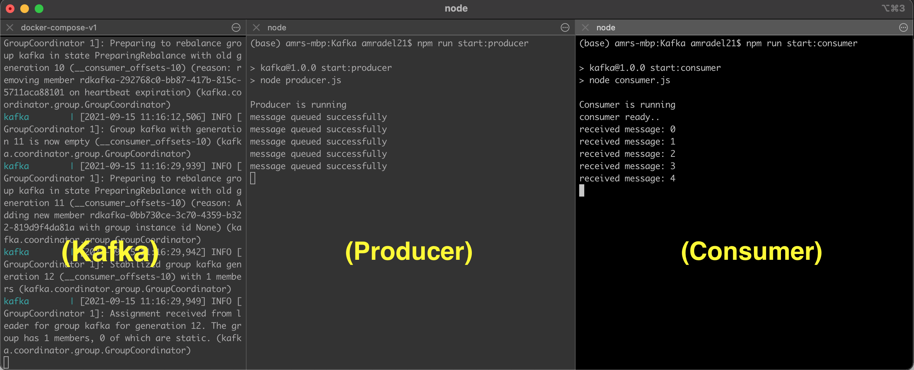

# kafka-node-docker

A kafka producer/consumer proof of concept using node js.

## Prerequisites

* `node`
* `docker`

## Running locally

* `npm install` - installs npm dependencies.
* `docker-compose up` - starts kafka inside docker container.
* `docker exec -it kafka /opt/bitnami/kafka/bin/kafka-topics.sh \
    --create \
    --zookeeper zookeeper:2181 \
    --replication-factor 1 \
    --partitions 1 \
    --topic test` - creates kafka topic.
* `npm run start:producer` - starts producer.
* `npm run start:consumer` - starts consumer.
